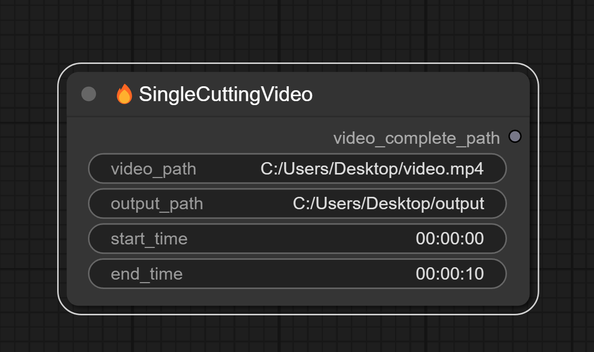
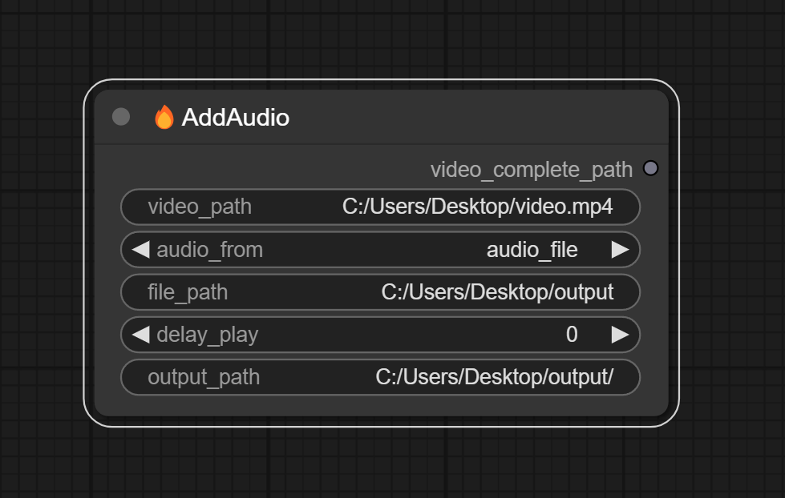

<h1 align="center">ComfyUI-FFmpeg</h1>

      中文 | <a href="README_EN.md">English</a>

## 介绍

把FFmpeg常用功能封装成ComfyUI节点，方便用户可以在ComfyUI上也可以进行各种视频处理。 

## 说明

使用该节点之前需要先安装FFmpeg，FFmpeg安装方法可以参考 [这里](https://www.bilibili.com/read/cv28108185/?spm_id_from=333.999.0.0&jump_opus=1)

## 安装 

#### 方法1:

1. 进入节点目录, `ComfyUI/custom_nodes/`
2. `git clone https://github.com/MoonHugo/ComfyUI-FFmpeg.git`
3. `cd ComfyUI-FFmpeg`
4. `pip install -r requirements.txt`
5. 重启ComfyUI

#### 方法2:
直接下载节点源码包，然后解压到custom_nodes目录下，最后重启ComfyUI

#### 方法3：
通过ComfyUI-Manager安装，搜索“ComfyUI-FFmpeg”进行安装

## 节点介绍

##### Video2Frames节点: 作用是将视频转为一张一张的图片，并保存到指定目录中 

###### 参数说明
**video_path**: 本地视频路径，比如：`C:\Users\Desktop\222.mp4` 
**output_path**: 输出图片保存路径，比如：`C:\Users\Desktop\output` 
**frames_max_width**: 这个参数可以用来缩放视频，默认为0，表示不缩放视频，如果frames_max_width大于视频实际宽度，则视频不会被放大，保持原宽度，如果frames_max_width小于视频实际宽度，则视频会被缩小。

___

##### Frames2Video节点: 作用是将图片转为视频，并保存到指定目录中 

###### 参数说明
**frame_path**: 本地图片路径，比如：`C:\Users\Desktop\output` 
**fps**: 视频帧率，默认为`30` 
**video_name**: 保存视频名称，比如：`222.mp4` 
**output_path**: 视频保存路径，比如：`C:\Users\Desktop\output` 
**audio_path**: 视频音频路径，比如：`C:\Users\Desktop\222.mp3` 
___

##### AddTextWatermark节点: 作用是在视频上添加文字水印 

###### 参数说明
**video_path**: 本地视频路径，比如：`C:\Users\Desktop\222.mp4` 
**output_path**: 视频保存路径，比如：`C:\Users\Desktop\output` 
**font_file**: 字体文件，需要把字体文件放到`custom_nodes\ComfyUI-FFmpeg\fonts`目录下，不仅英文字体，中文字体也可以，比如：`ComfyUI\custom_nodes\ComfyUI-FFmpeg\fonts\Alibaba-PuHuiTi-Heavy.ttf` 
**font_size**: 水印文字大小，比如：`40` 
**font_color**: 水印文字颜色，比如：`#FFFFFF`或者`white` 
**position_x**: 水印文字x坐标，比如：`100` 
**position_y**: 水印文字y坐标，比如：`100` 

___

##### AddImgWatermark节点: 作用是在视频上添加图片水印 

###### 参数说明
**video_path**: 本地视频路径，比如：`C:\Users\Desktop\222.mp4` 
**output_path**: 视频保存路径，比如：`C:\Users\Desktop\output` 
**watermark_image**: 水印图片路径，比如：`C:\Users\Desktop\watermark.png` 
**watermark_img_width**: 水印图片宽度，比如：`100` 
**position_x**: 水印图片在视频中的x坐标，比如：`100` 
**position_y**: 水印图片在视频中的y坐标，比如：`100` 
___

##### VideoFlip节点: 作用是翻转视频 

###### 参数说明
**video_path**: 本地视频路径，比如：`C:\Users\Desktop\222.mp4` 
**output_path**: 视频保存路径，比如：`C:\Users\Desktop\output` 
**flip_type**: 翻转类型，比如：`horizontal`水平翻转，`vertical`垂直翻转，`both`水平加垂直翻转 

___

##### ExtractAudio节点：作用是提取视频中的音频 

###### 参数说明
**video_path**: 本地视频路径，比如：`C:\Users\Desktop\222.mp4` 
**output_path**: 音频保存路径，比如：`C:\Users\Desktop\output` 
**audio_format**: 保存音频格式，包括 **.m4a**，**.mp3**，**.wav**，**.aac**，**.flac**，**.wma**，**.ogg**，**.ac3**，**.amr**，**.aiff**，**.opus**，**.m4b**，**.caf**，**.dts** 等等。 
___

##### MergingVideoByTwo节点: 作用是合并两个视频，比如把两个一小时的视频合并成一个时长为2小时的视频 

###### 参数说明
**video1_path**: 视频路径，比如：`C:\Users\Desktop\111.mp4` 
**video2_path**: 视频路径，比如：`C:\Users\Desktop\222.mp4` 
**device**: 分为CPU和GPU，如果你用CPU合并两个视频出错的话，可以尝试用GPU。 
**resolution_reference**: 合并后的视频尺寸是多少，可以参考第一个视频或者第二个视频，即video1或者video2。 
**output_path**: 视频保存路径，比如：`C:\Users\Desktop\output` 

___

##### MergingVideoByPlenty节点: 作用是把多个编码格式、分辨率、帧率都一样的短视频合并成长视频 

###### 参数说明
**video_path**: 视频路径，比如：`C:\Users\Desktop\111`，要求该路径下所有视频的编码格式、帧率以及分辨率一样。 
**output_path**: 视频保存路径，比如：`C:\Users\Desktop\output` 
___

##### StitchingVideo节点: 作用是拼接两个视频，分成水平拼接和垂直拼接两种拼接方式 

###### 参数说明
**video1_path**: 视频路径，比如：`C:\Users\Desktop\111.mp4` 
**video2_path**: 视频路径，比如：`C:\Users\Desktop\222.mp4` 
**device**: 分为CPU和GPU，如果你用CPU拼接两个视频出错的话，可以尝试用GPU。 
**use_audio**: 拼接后的视频使用哪个视频的音频，可以选择第一个视频的音频或者第二个视频的音频，即video1或者video2。 
**stitching_type**: 拼接视频方式，分为水平拼接（horizontal）和垂直拼接（vertical）两种方式。 
**output_path**: 视频保存路径，比如：`C:\Users\Desktop\output` 

___

##### MultiCuttingVideo节点: 作用是把一个视频切割成若干个视频 

###### 参数说明
**video_path**: 视频路径，比如：`C:\Users\Desktop\111.mp4` 
**output_path**: 视频保存路径，比如：`C:\Users\Desktop\output` 
**segment_time**: 切割的每个视频长度，单位为秒，需要注意的是，它是根据关键帧切割视频的，所以时间不能太短。因为不能保证每一段视频都有关键帧，所以每一段视频时长不一定都一样，只是最接近的。 

___

##### SingleCuttingVideo节点: 作用是切割指定视频中某个时间段的视频 

###### 参数说明
**video_path**: 视频路径，比如：`C:\Users\Desktop\111.mp4` 
**output_path**: 视频保存路径，比如：`C:\Users\Desktop\output` 
**start_time**: 设置切割的开始时间点，设置为00:00:10的话就表示从视频中的第10秒开始切割。 
**end_time**: 设置切割的结束时间点，设置为00:05:00，表示切割到视频中的第5分钟为止。 

___

##### AddAudio节点: 作用是给视频添加音频 

###### 参数说明
**video_path**: 视频路径，比如：`C:\Users\Desktop\111.mp4` 
**audio_from**: 音频来源，可以来源于音频文件，也可以来源于视频文件，即audio_file、video_file。 
**file_path**: 如果audio_from为audio_file，这里就填入一个音频文件路径，如果audio_from为video_file，那么这里就填入一个视频文件路径，比如：`C:\Users\Desktop\111.mp3` 或者 `C:\Users\Desktop\111.mp4` 
**delay_play**: 音频延迟播放时间，单位为秒，默认值为0。 
**output_path**: 视频保存路径，比如：`C:\Users\Desktop\output` 

___

## 社交账号
- Bilibili：[我的B站主页](https://space.bilibili.com/1303099255)

## 感谢

感谢FFmpeg仓库的所有作者 [FFmpeg/FFmpeg](https://github.com/FFmpeg/FFmpeg)

## 关注历史

