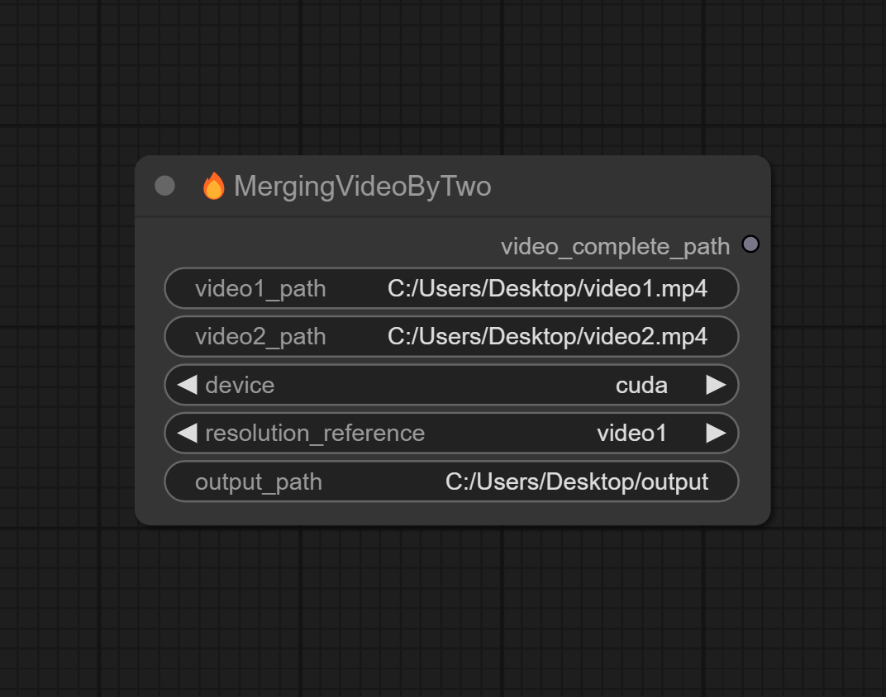
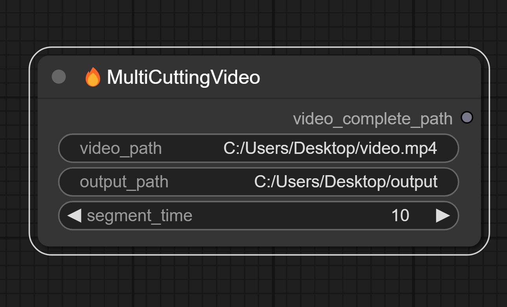
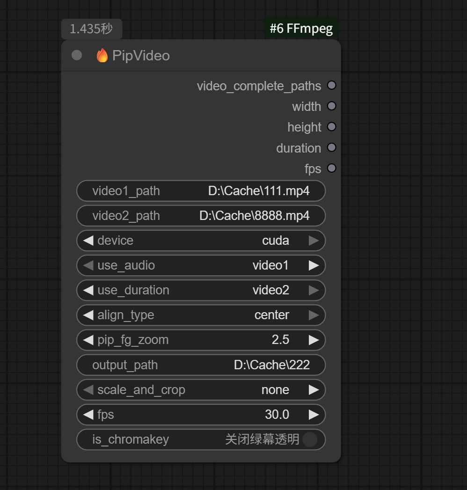
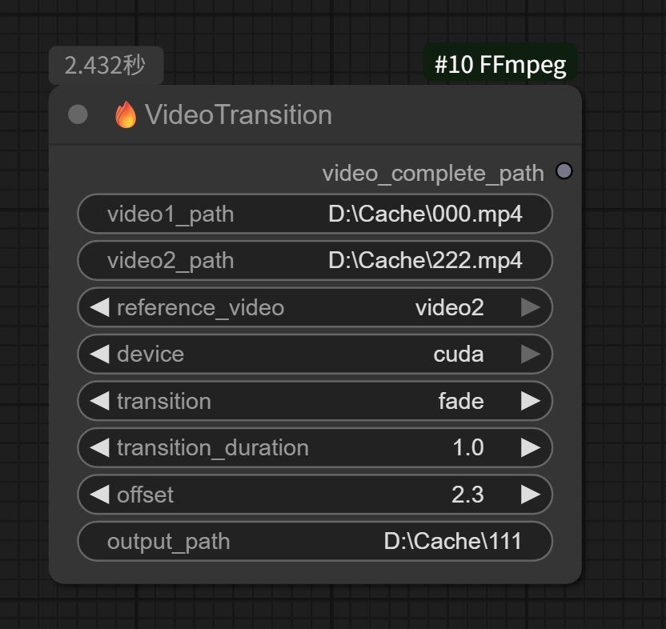

<h1 align="center">ComfyUI-FFmpeg</h1>

      English | <a href="README.md">中文</a>

## Introduction

Encapsulate the commonly used functions of FFmpeg into ComfyUI nodes, making it convenient for users to perform various video processing tasks within ComfyUI. 

## Tips

You need to install FFmpeg before using this node, the FFmpeg installation method can refer to [here](https://www.bilibili.com/read/cv28108185/?spm_id_from=333.999.0.0&jump_opus=1)

## Installation 

#### Method 1:

1. Go to comfyUI custom_nodes folder, `ComfyUI/custom_nodes/`
2. `git clone https://github.com/MoonHugo/ComfyUI-FFmpeg.git`
3. `cd ComfyUI-FFmpeg`
4. `pip install -r requirements.txt`
5. restart ComfyUI

#### Method 2:
Directly download the node source package, then extract it into the custom_nodes directory, and finally restart ComfyUI.

#### Method 3：
Install through ComfyUI-Manager by searching for 'ComfyUI-BiRefNet-Hugo' and installing it.

## Nodes introduction

##### Video2Frames Node: The function is to convert a video into images and save them to a specified directory. 

###### Parameter Description
**video_path**: the local video path, e.g.：`C:\Users\Desktop\222.mp4` 
**output_path**: the path to save the output images, e.g.：`C:\Users\Desktop\output` 
**frames_max_width**: this parameter can be used to resize the video. The default value is 0, which means the video will not be resized. If frames_max_width is larger than the actual width of the video, the video will not be enlarged and will retain its original width. If frames_max_width is smaller than the actual width of the video, the video will be scaled down.

___

##### Frames2Video Node: The function is to convert images into a video and save it to a specified directory. 

###### Parameter Description
**frame_path**: local image path, e.g.:`C:\Users\Desktop\output` 
**fps**: video frame rate, default is`30` 
**video_name**: saved video name, e.g.:`222.mp4` 
**output_path**: video save path,e.g.:`C:\Users\Desktop\output` 
**audio_path**: video audio path,e.g.:`C:\Users\Desktop\222.mp3` 
___

##### AddTextWatermark Node: The function is to add a text watermark to the video. 

###### Parameter Description
**video_path**: local video path,e.g.:`C:\Users\Desktop\222.mp4` 
**output_path**: video save path,e.g.:`C:\Users\Desktop\output` 
**font_file**: font file: The font file needs to be placed in the`custom_nodes\ComfyUI-FFmpeg\fonts` directory. Not only English fonts, but Chinese fonts can also be used.,e.g.:`ComfyUI\custom_nodes\ComfyUI-FFmpeg\fonts\Alibaba-PuHuiTi-Heavy.ttf` 
**font_size**: watermark text size,e.g.:`40` 
**font_color**: watermark text color,e.g.:`#FFFFFF` or `white` 
**position_x**: watermark text x-coordinate,e.g.:`100` 
**position_y**: watermark text y-coordinate,e.g.:`100` 

___

##### AddImgWatermark Node: The function is to add an image watermark to the video. 

###### Parameter Description
**video_path**: local video path,e.g.:`C:\Users\Desktop\222.mp4` 
**output_path**: video save path,e.g.:`C:\Users\Desktop\output` 
**watermark_image**: watermark image path,e.g.:`C:\Users\Desktop\watermark.png` 
**watermark_img_width**: watermark image width,e.g.:`100` 
**position_x**: watermark image x-coordinate in the video,e.g.:`100` 
**position_y**: watermark image y-coordinate in the video,e.g.:`100` 
___

##### VideoFlip Node: The function is to flip the video 

###### Parameter Description
**video_path**: local video path,e.g.:`C:\Users\Desktop\222.mp4` 
**output_path**: video save path,e.g.:`C:\Users\Desktop\output` 
**flip_type**: flip type, e.g. `horizontal` horizontal flip, `vertical` vertical flip, `both` horizontal plus vertical flip 

___

##### ExtractAudio Node：The purpose is to extract the audio from the video 

###### Parameter Description
**video_path**: local video path,e.g.:`C:\Users\Desktop\222.mp4` 
**output_path**: audio save path,e.g.:`C:\Users\Desktop\output` 
**audio_format**: save audio formats, including **.m4a** , **.mp3** , **.wav** , **.aac** , **.flac** , **.wma** , **.ogg** , **.ac3** , **.amr** , **.aiff** , **.opus** , **.m4b** , **.caf** , **.dts** etc.  

___

##### MergingVideoByTwo Node: The purpose is to merge two videos, for example, to combine two one-hour videos into a single two-hour video. 

###### Parameter Description
**video1_path**: local video path,e.g.:`C:\Users\Desktop\111.mp4` 
**video2_path**: local video path,e.g.:`C:\Users\Desktop\222.mp4` 
**device**: there are two options: CPU and GPU,if you encounter an error while merging two videos using the CPU option, you can try using the GPU instead. 
**resolution_reference**: What is the size of the merged video? You can refer to either the first video or the second video, that is, video1 or video2. 
**output_path**: video save path,e.g.:`C:\Users\Desktop\output` 

___

##### MergingVideoByPlenty Node: The purpose is to merge multiple short videos that have the same encoding format, resolution, and frame rate into a longer video. 

###### Parameter Description
**video_path**: local video path,e.g.:`C:\Users\Desktop\111`,All videos in the specified path must have the same encoding format, frame rate, and resolution. 
**output_path**: video save path,e.g.:`C:\Users\Desktop\output` 

___

##### StitchingVideo Node: The purpose is to stitching two videos, which can be done in two ways: horizontal stitching and vertical stitching. 

###### Parameter Description
**video1_path**: local video path,e.g.:`C:\Users\Desktop\111.mp4` 
**video2_path**: local video path,e.g.:`C:\Users\Desktop\222.mp4` 
**device**: there are two options: CPU and GPU, if you encounter an error while stitching two videos using the CPU, you can try using the GPU instead. 
**use_audio**: which audio will be used in the stitched video? You can choose the audio from either the first video or the second video, that is, from video1 or video2. 
**stitching_type**: the methods for stitching videos are divided into two types: horizontal stitching and vertical stitching. 
**output_path**: video save path,e.g.:`C:\Users\Desktop\output` 
**scale_and_crop**: Scale and crop to match video1's dimensions. 
___

##### MultiCuttingVideo Node: The purpose is to split one video into several smaller videos. 

###### Parameter Description
**video_path**: local video path,e.g.:`C:\Users\Desktop\111.mp4` 
**output_path**: video save path,e.g.:`C:\Users\Desktop\output` 
**segment_time**: the length of each cut video is measured in seconds. It’s important to note that the video is cut based on keyframes, so the duration cannot be too short. Since there is no guarantee that each segment of the video will have a keyframe, the duration of each segment may not be the same, but it will be the closest possible. 

___

##### SingleCuttingVideo Node: The purpose is to cut a specific time segment from a designated video. 

###### Parameter Description
**video_path**: local video path,e.g.:`C:\Users\Desktop\111.mp4` 
**output_path**: video save path,e.g.:`C:\Users\Desktop\output` 
**start_time**: set the start time for the cut; for example, setting it to 00:00:10 means cutting from the 10th second of the video. 
**end_time**: set the end time for the cut; for example, setting it to 00:05:00 means cutting until the 5th minute of the video. 
___

##### AddAudio Node: The purpose is to add audio to the video. 

###### Parameter Description
**video_path**: local video path,e.g.:`C:\Users\Desktop\111.mp4` 
**audio_from**: the audio source can be from an audio file or from a video file, that is, audio_file or video_file. 
**file_path**: if audio_from is set to audio_file, then enter the path of an audio file here,if audio_from is set to video_file, then enter the path of a video file here, for example: `C:\Users\Desktop\111.mp3` or `C:\Users\Desktop\111.mp4` 
**delay_play**: the audio delay playback time is measured in seconds, with a default value of 0. 
**output_path**: video save path,e.g.:`C:\Users\Desktop\output` 

___

##### PipVideo Node: Add picture-in-picture functionality to videos 

###### Parameter Description
**video1_path**: The background video for picture-in-picture (PIP), e.g.:`C:\Users\Desktop\111.mp4` 
**video2_path**: The foreground video for PIP, e.g.:`C:\Users\Desktop\222.mp4` 
**device**: Choose between CPU and GPU. If errors occur with CPU, try switching to GPU. 
**use_audio**: Select which video's audio to use in the final output—either video1 or video2. 
**use_duration**: Determine the final video's duration based on video1 or video2. 
**align_type**: Position of the foreground video on the background—options: top-left, top-right, bottom-left, bottom-right, or center. 
**pip_fg_zoom**: PIP foreground scaling factor—larger values make the foreground smaller (scaled relative to background dimensions). 
**output_path**: Output video save path, e.g.:`C:\Users\Desktop\output` 
**scale_and_crop**: Scaling and cropping ratio. 
**fps**: v 
**is_chromakey**: Whether to apply green screen (chroma key) background removal. 

___

##### VideoTransition Node: Add Transition Animation Effects to Two Videos 

###### Parameter Description
**video1_path**: local video path,e.g.:`C:\Users\Desktop\111.mp4` 
**video2_path**: local video path,e.g.:`C:\Users\Desktop\222.mp4` 
**reference_video**: Specifies which video serves as the reference for determining the output video's dimensions and frame rate. 
**device**: Choose between CPU and GPU. If errors occur with CPU, try switching to GPU. 
**transition**: Transition effect name. Default options include:'fade', 'wipeleft', 'wiperight', 'wipeup', 'wipedown','slideleft', 'slideright', 'slideup', 'slidedown','circlecrop', 'rectcrop', 'distance', 'fadeblack', 'fadewhite','radial', 'smoothleft', 'smoothright', 'smoothup', 'smoothdown','circleopen', 'circleclose', 'vertopen', 'vertclose','horzopen', 'horzclose', 'dissolve', 'pixelize','diagtl', 'diagtr', 'diagbl', 'diagbr','hlslice', 'hrslice', 'vuslice', 'vdslice','hblur', 'fadegrays', 'wipetl', 'wipetr', 'wipebl', 'wipebr','squeezeh', 'squeezev', 'zoomin', 'fadefast', 'fadeslow','hlwind', 'hrwind', 'vuwind', 'vdwind','coverleft', 'coverright', 'coverup', 'coverdown','revealleft', 'revealright', 'revealup', 'revealdown'，To check available transitions for your local FFmpeg version, run: `ffmpeg -hide_banner -h filter=xfade`. 
**transition_duration**: Transition duration in seconds. Maximum value: 3 seconds; cannot be < 0.1. 
**offset**: Transition start time in seconds. Cannot be ≥ (duration of video1 duration minus transition_duration). 
**output_path**: Output video save path, e.g.:`C:\Users\Desktop\output` 

___

## Social Account Homepage
- Bilibili：[My BILIBILI Homepage](https://space.bilibili.com/1303099255)

## Acknowledgments

Thanks to all the contributors of the FFmpeg repository. [FFmpeg/FFmpeg](https://github.com/FFmpeg/FFmpeg)

## Star history

